# Architecture Backend Hypertube

## Table des Matières

1. [Technologies Utilisées](#1-technologies-utilisées)
2. [Structure du Projet](#2-structure-du-projet)
3. [Couche Domain](#3-couche-domain)
4. [Couche Application](#4-couche-application)
5. [Couche Infrastructure](#5-couche-infrastructure)
6. [Couche WebAPI](#6-couche-webapi)
7. [Flux de Requête](#7-flux-de-requête)
8. [Flux d'Authentification](#8-flux-dauthentification)
9. [Flux de Recherche et Téléchargement](#9-flux-de-recherche-et-téléchargement)
10. [Client BitTorrent Custom](#10-client-bittorrent-custom)
11. [Services Externes](#12-services-externes)
12. [Base de Données](#13-base-de-données)
13. [Déploiement](#14-déploiement)

---

## 1. Technologies Utilisées

### Backend Core
- **.NET 8.0** - Framework principal
- **ASP.NET Core 8.0** - Web API
- **C# 12** - Langage de programmation

### Base de Données
- **PostgreSQL 16** - Base de données relationnelle
- **Entity Framework Core 8.0** - ORM (Object-Relational Mapping)
- **Npgsql** - Provider PostgreSQL pour EF Core

### Authentification & Sécurité
- **ASP.NET Identity** - Gestion des utilisateurs et rôles
- **JWT Bearer Authentication** - Authentification par tokens
- **OAuth 2.0** - Authentification Google

### Logging
- **Serilog** - Logging structuré avec support fichier et console

### Documentation
- **Swagger / OpenAPI** - Documentation API interactive

### Traitement Vidéo
- **FFmpeg** - Conversion et analyse vidéo
- **FFMpegCore** - Wrapper .NET pour FFmpeg

### BitTorrent
- **Client Custom** - Implémentation custom du protocole BitTorrent

### Services Externes
- **TMDB API** - Métadonnées de films (posters, ratings, cast)
- **YTS API** - Source de torrents
- **PirateBay API** - Source de torrents
- **OpenSubtitles API** - Sous-titres
- **SendGrid API** - Envoi d'emails

---

## 2. Structure du Projet

```
backend/
├── Hypertube.sln                           # Solution principale
├── src/
│   ├── Domain/                             # Couche Domain
│   │   └── Hypertube.Domain/
│   │       └── Entities/                   # Entités métier
│   │           ├── User.cs
│   │           ├── Movie.cs
│   │           ├── Torrent.cs
│   │           ├── Comment.cs
│   │           ├── RefreshToken.cs
│   │           └── OAuthProvider.cs
│   │
│   ├── Application/                        # Couche Application
│   │   └── Hypertube.Application/
│   │       ├── Authentication/             # Services d'authentification
│   │       │   ├── Services/
│   │       │   │   ├── IAuthenticationService.cs
│   │       │   │   └── ITokenService.cs
│   │       │   └── DTOs/                   # Data Transfer Objects
│   │       │       ├── LoginDto.cs
│   │       │       ├── RegisterDto.cs
│   │       │       └── AuthResponse.cs
│   │       │
│   │       ├── Movies/                     # Services de films
│   │       │   ├── Services/
│   │       │   │   ├── IMovieService.cs
│   │       │   │   ├── ITorrentSearchService.cs
│   │       │   │   ├── ITorrentDownloadService.cs
│   │       │   │   ├── IMovieMetadataService.cs
│   │       │   │   └── ICommentService.cs
│   │       │   └── DTOs/
│   │       │       ├── MovieDto.cs
│   │       │       ├── TorrentSearchResultDto.cs
│   │       │       └── CommentDto.cs
│   │       │
│   │       ├── Profile/                    # Services de profil
│   │       │   ├── Services/
│   │       │   │   └── IProfileService.cs
│   │       │   └── DTOs/
│   │       │       └── UpdateProfileDto.cs
│   │       │
│   │       └── Common/                     # Services communs
│   │           └── Services/
│   │               ├── IEmailService.cs
│   │               ├── ISubtitleService.cs
│   │               ├── IVideoConversionService.cs
│   │               └── IVideoRemuxService.cs
│   │
│   ├── Infrastructure/                     # Couche Infrastructure
│   │   ├── Hypertube.Infrastructure/
│   │   │   ├── Persistence/                # Accès aux données
│   │   │   │   ├── HypertubeDbContext.cs
│   │   │   │   └── Migrations/
│   │   │   │
│   │   │   ├── Authentication/             # Implémentation auth
│   │   │   │   ├── TokenService.cs
│   │   │   │   └── AuthenticationService.cs
│   │   │   │
│   │   │   ├── Services/                   # Implémentation services
│   │   │   │   ├── MovieService.cs
│   │   │   │   ├── TorrentSearchService.cs
│   │   │   │   ├── TorrentDownloadService.cs
│   │   │   │   ├── CommentService.cs
│   │   │   │   ├── ProfileService.cs
│   │   │   │   ├── VideoConversionService.cs
│   │   │   │   ├── VideoCodecDetector.cs
│   │   │   │   └── VideoRemuxService.cs
│   │   │   │
│   │   │   ├── ExternalServices/           # Services externes
│   │   │   │   ├── YtsService.cs
│   │   │   │   ├── PirateBayService.cs
│   │   │   │   ├── TmdbService.cs
│   │   │   │   ├── SubtitleService.cs
│   │   │   │   └── EmailService.cs
│   │   │   │
│   │   │   └── Streaming/                  # Services de streaming
│   │   │       └── TorrentSeedingService.cs
│   │   │
│   │   └── Hypertube.BitTorrent/           # Client BitTorrent
│   │       ├── TorrentClient.cs
│   │       ├── Bencode/                    # Encodage Bencode
│   │       ├── FileIO/                     # Opérations fichiers
│   │       ├── Models/                     # Modèles BitTorrent
│   │       ├── Parsers/                    # Parsers torrent
│   │       ├── PeerWire/                   # Protocol peer-to-peer
│   │       ├── PieceManagement/            # Gestion des pieces
│   │       ├── Tracker/                    # Communication tracker
│   │       └── Utils/                      # Utilitaires
│   │
│   └── WebAPI/                             # Couche Présentation
│       └── Hypertube.WebAPI/
│           ├── Program.cs                  # Point d'entrée
│           ├── appsettings.json            # Configuration
│           ├── Controllers/                # Controllers API
│           │   ├── AuthController.cs
│           │   ├── UsersController.cs
│           │   ├── MoviesController.cs
│           │   ├── TorrentsController.cs
│           │   ├── CommentsController.cs
│           │   ├── SubtitlesController.cs
│           │   └── HealthController.cs
│           └── Swagger/                    # Configuration Swagger
│
└── tests/                                  # Tests
    └── BitTorrent.ComparativeTests/
```

---

## 3. Couche Domain

La couche **Domain** contient les entités métier pures sans aucune dépendance externe.

### Diagramme des Entités

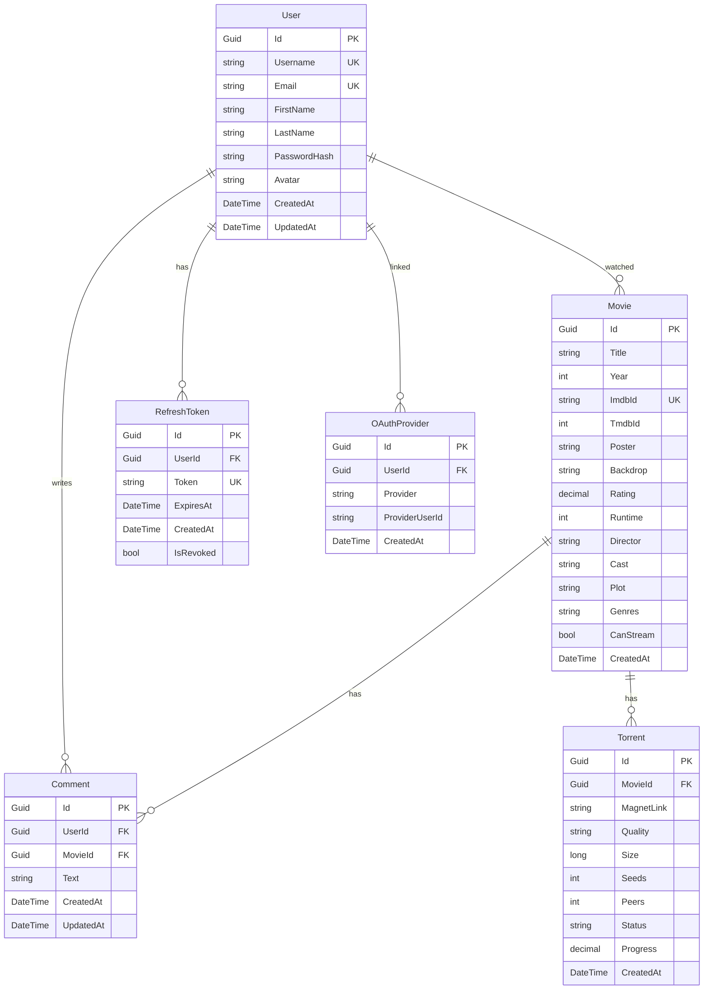

### Entités Principales

**User** : Représente un utilisateur de l'application
- Authentification locale ou OAuth
- Profil (avatar, prénom, nom)
- Liste de films visionnés
- Commentaires postés

**Movie** : Représente un film
- Métadonnées enrichies depuis TMDB
- Identifiants IMDb et TMDB
- Informations de streaming

**Torrent** : Représente un téléchargement torrent
- Lien vers le film
- Progression du téléchargement
- Statistiques (seeds, peers)

**Comment** : Représente un commentaire sur un film
- Lien vers l'utilisateur et le film
- Contenu textuel (max 1000 caractères)

---

## 4. Couche Application

La couche **Application** définit la logique métier et les interfaces de services.

### Services Principaux

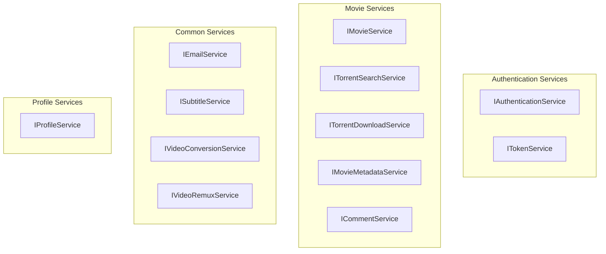

### Responsabilités par Service

**IAuthenticationService**
- Register : Créer un nouveau compte
- Login : Authentifier un utilisateur
- RefreshToken : Rafraîchir le token d'accès
- ResetPassword : Réinitialiser le mot de passe

**ITokenService**
- GenerateAccessToken : Générer un JWT access token (15 min)
- GenerateRefreshToken : Générer un refresh token (7 jours)
- ValidateToken : Valider un token

**IMovieService**
- GetPopularAsync : Obtenir les films populaires
- SearchAsync : Rechercher des films avec filtres
- GetMovieAsync : Obtenir les détails d'un film
- MarkAsWatchedAsync : Marquer un film comme visionné

**ITorrentSearchService**
- SearchAsync : Rechercher sur YTS + PirateBay
- GetPopularAsync : Obtenir les torrents populaires
- Agrégation et déduplication des résultats

**ITorrentDownloadService**
- StartDownloadAsync : Démarrer un téléchargement torrent
- GetStatusAsync : Obtenir le statut d'un download
- CancelDownloadAsync : Annuler un download
- Gestion de la priorité (début de fichier en premier)

**IMovieMetadataService**
- EnrichMovieMetadataAsync : Enrichir avec TMDB
- SearchByImdbIdAsync : Rechercher par IMDb ID
- SearchByTitleAsync : Rechercher par titre

**ICommentService**
- GetMovieCommentsAsync : Lister les commentaires d'un film
- CreateCommentAsync : Créer un commentaire
- UpdateCommentAsync : Modifier un commentaire (owner)
- DeleteCommentAsync : Supprimer un commentaire (owner)

---

## 5. Couche Infrastructure

La couche **Infrastructure** implémente les interfaces définies dans Application.

### Architecture Infrastructure

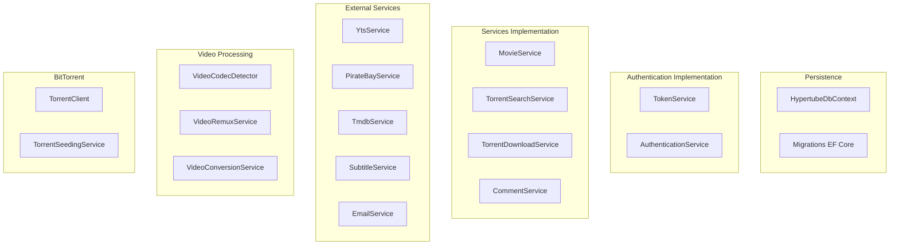

### HypertubeDbContext

```csharp
public class HypertubeDbContext : IdentityDbContext<User, IdentityRole<Guid>, Guid>
{
    public DbSet<Movie> Movies { get; set; }
    public DbSet<Torrent> Torrents { get; set; }
    public DbSet<Comment> Comments { get; set; }
    public DbSet<RefreshToken> RefreshTokens { get; set; }
    public DbSet<OAuthProvider> OAuthProviders { get; set; }
}
```

---

## 6. Couche WebAPI

La couche **WebAPI** expose l'API REST et configure l'application.

### Controllers

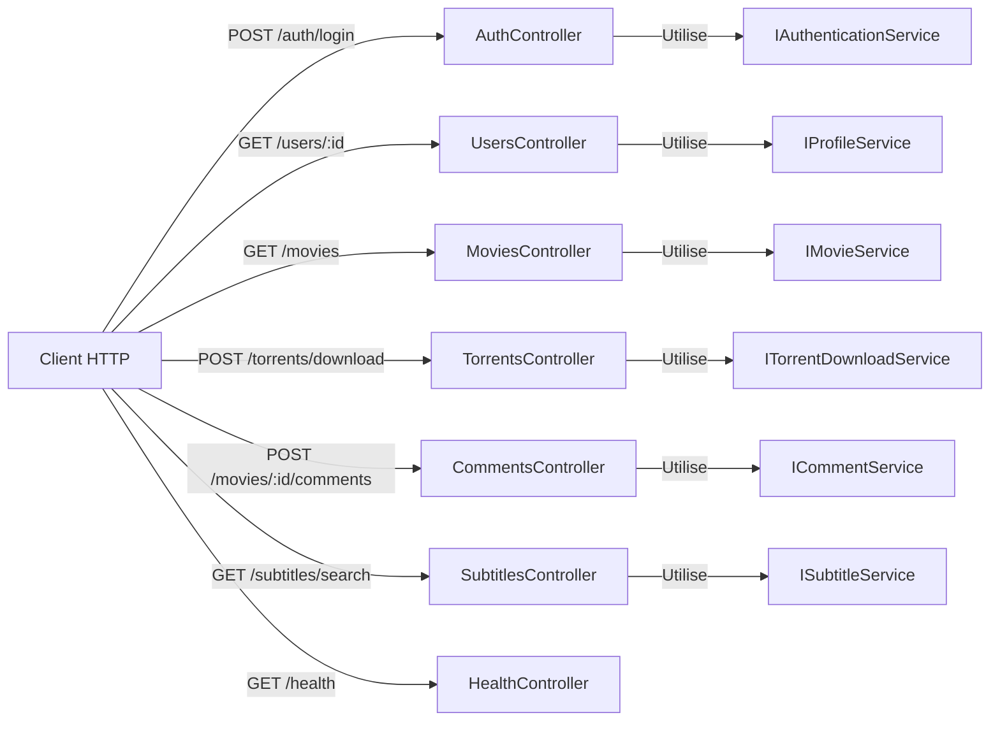

### Configuration (Program.cs)

```csharp
// 1. Configuration des services
builder.Services.AddDbContext<HypertubeDbContext>();
builder.Services.AddIdentity<User, IdentityRole<Guid>>();
builder.Services.AddAuthentication(JwtBearerDefaults.AuthenticationScheme);

// 2. Enregistrement des services
builder.Services.AddScoped<IAuthenticationService, AuthenticationService>();
builder.Services.AddScoped<IMovieService, MovieService>();
builder.Services.AddSingleton<ITorrentDownloadService, TorrentDownloadService>();

// 3. Configuration du pipeline
app.UseAuthentication();
app.UseAuthorization();
app.MapControllers();
```

---

## 7. Flux de Requête

### Flux HTTP Standard

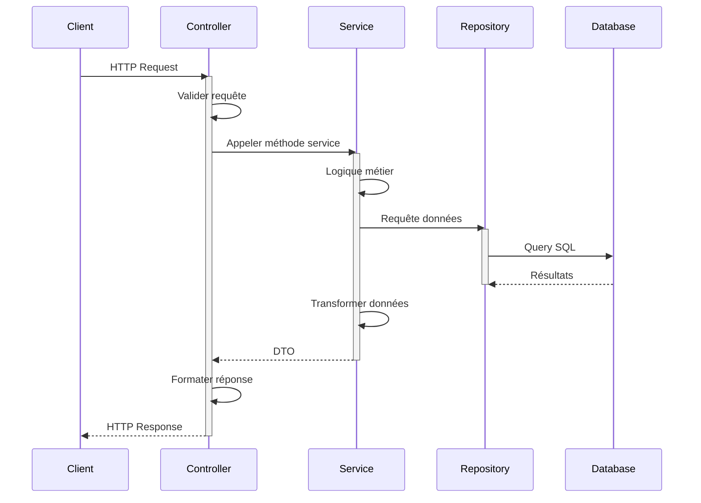

### Exemple Concret : Obtenir un Film

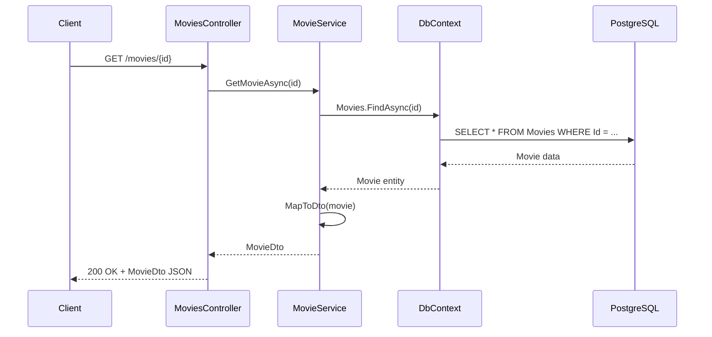

---

## 8. Flux d'Authentification

### Inscription et Connexion

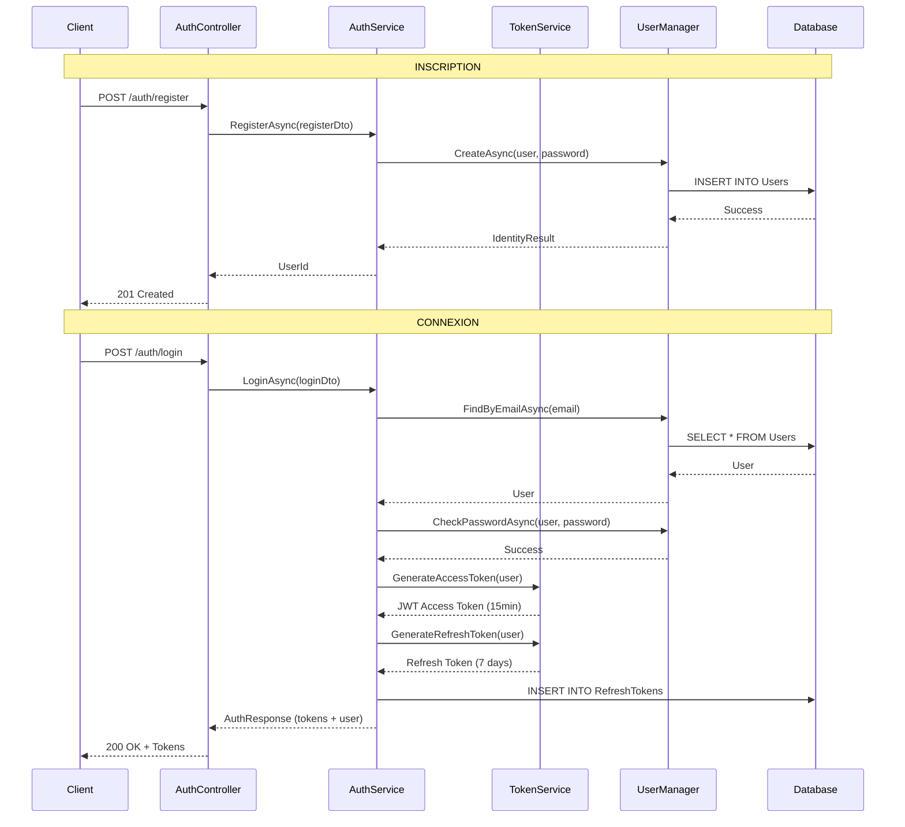

### Rafraîchissement de Token

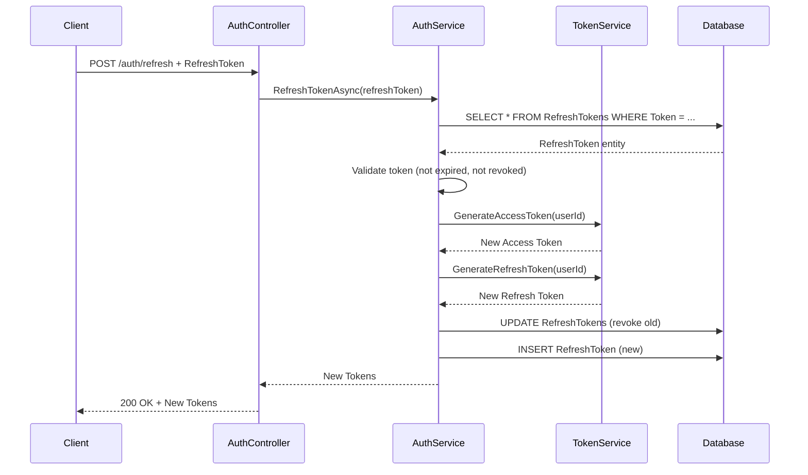

---

## 9. Flux de Recherche et Téléchargement

### Recherche de Films

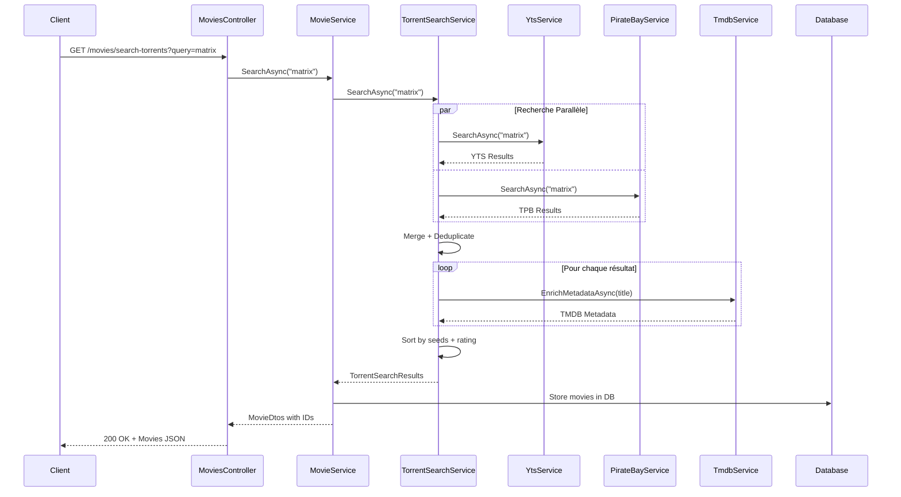

### Téléchargement Torrent

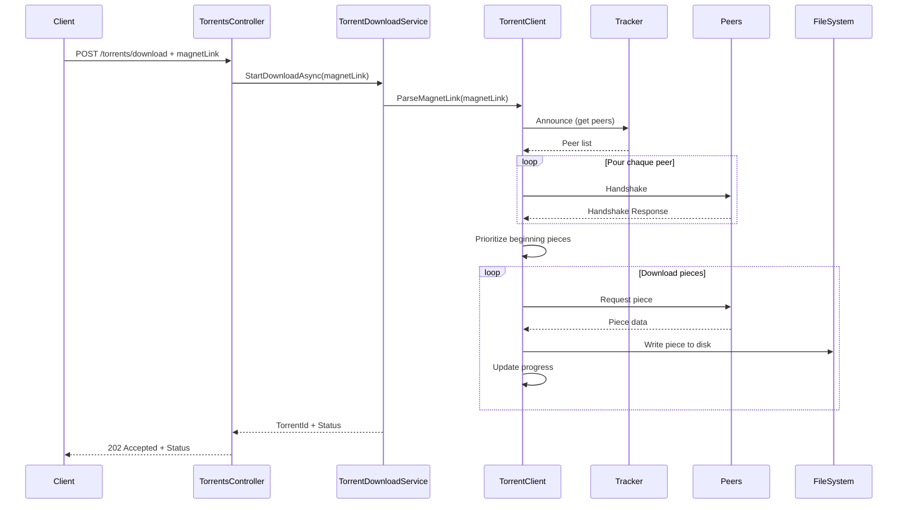

---

## 10. Client BitTorrent Custom

### Architecture du Client

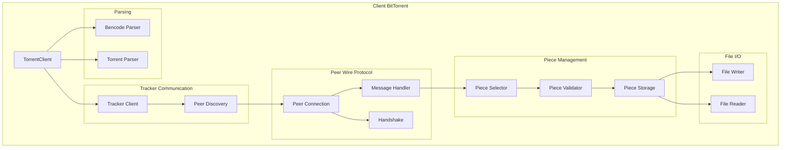

### Stratégie de Téléchargement

**Priorité des Pieces** : Le début du fichier est téléchargé en premier pour permettre le streaming rapide.

```
Fichier vidéo : [========================================] 100%
Priorité :      [HIGH ][MED ][LOW ][LOW ][MED ][LOW]
                 0-10%  10-20 20-40 40-60 60-80 80-100

Ordre de download : 0-10% → 10-20% → 60-80% → 20-40% → 80-100% → 40-60%
```

---

## 11. Services Externes

### Intégrations

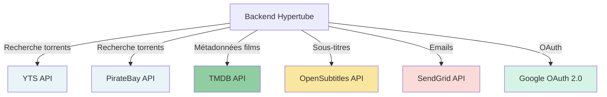

### Configuration Requise

**Variables d'Environnement :**

```bash
# TMDB
TMDB_API_KEY=votre-cle-api
TMDB_TOKEN=votre-token

# OpenSubtitles
OPENSUBTITLES_API_KEY=votre-cle-api

# SendGrid
SENDGRID_API_KEY=votre-cle-api

# Google OAuth
GOOGLE_CLIENT_ID=votre-client-id
GOOGLE_CLIENT_SECRET=votre-client-secret
```

---

## 12. Base de Données

### Schéma PostgreSQL

```sql
-- Simplified schema

-- Users (gérés par ASP.NET Identity)
CREATE TABLE "AspNetUsers" (
    "Id" UUID PRIMARY KEY,
    "UserName" VARCHAR(256) UNIQUE NOT NULL,
    "Email" VARCHAR(256) UNIQUE NOT NULL,
    "PasswordHash" TEXT,
    "FirstName" VARCHAR(100),
    "LastName" VARCHAR(100),
    "Avatar" TEXT,
    "CreatedAt" TIMESTAMP DEFAULT NOW()
);

-- Movies
CREATE TABLE "Movies" (
    "Id" UUID PRIMARY KEY,
    "Title" VARCHAR(500) NOT NULL,
    "Year" INT NOT NULL,
    "ImdbId" VARCHAR(20) UNIQUE NOT NULL,
    "TmdbId" INT,
    "Poster" TEXT,
    "Rating" DECIMAL(3,1),
    "Director" VARCHAR(200),
    "Cast" TEXT,
    "Plot" TEXT,
    "Genres" TEXT,
    "CreatedAt" TIMESTAMP DEFAULT NOW(),
    INDEX idx_imdbid ("ImdbId"),
    INDEX idx_title ("Title")
);

-- Torrents
CREATE TABLE "Torrents" (
    "Id" UUID PRIMARY KEY,
    "MovieId" UUID REFERENCES "Movies"("Id"),
    "MagnetLink" TEXT NOT NULL,
    "Quality" VARCHAR(10),
    "Size" BIGINT,
    "Seeds" INT,
    "Peers" INT,
    "Status" VARCHAR(20),
    "Progress" DECIMAL(5,2),
    "CreatedAt" TIMESTAMP DEFAULT NOW()
);

-- Comments
CREATE TABLE "Comments" (
    "Id" UUID PRIMARY KEY,
    "UserId" UUID REFERENCES "AspNetUsers"("Id"),
    "MovieId" UUID REFERENCES "Movies"("Id"),
    "Text" VARCHAR(1000) NOT NULL,
    "CreatedAt" TIMESTAMP DEFAULT NOW(),
    "UpdatedAt" TIMESTAMP DEFAULT NOW()
);

-- RefreshTokens
CREATE TABLE "RefreshTokens" (
    "Id" UUID PRIMARY KEY,
    "UserId" UUID REFERENCES "AspNetUsers"("Id"),
    "Token" TEXT UNIQUE NOT NULL,
    "ExpiresAt" TIMESTAMP NOT NULL,
    "IsRevoked" BOOLEAN DEFAULT FALSE,
    "CreatedAt" TIMESTAMP DEFAULT NOW(),
    INDEX idx_token ("Token")
);
```

### Migrations

```bash
# Créer une migration
dotnet ef migrations add MigrationName --project src/Infrastructure/Hypertube.Infrastructure

# Appliquer les migrations
dotnet ef database update --project src/Infrastructure/Hypertube.Infrastructure

# Migrations appliquées automatiquement au démarrage de l'application
```

---

## 13. Déploiement

### Architecture Docker

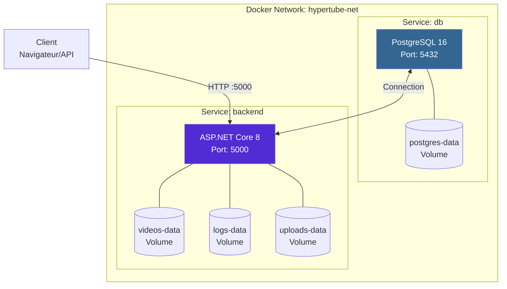

### Démarrage

```bash
# 1. Configuration des variables d'environnement
cp .env.example .env
# Éditer .env avec vos clés API

# 2. Démarrer les services
docker-compose up -d

# 3. Vérifier les logs
docker-compose logs -f backend

# 4. Accéder à l'API
# API : http://localhost:5000
# Swagger : http://localhost:5000/swagger
# Health : http://localhost:5000/health
```

### Variables d'Environnement Requises

```bash
# Database
DATABASE_URL=Host=db;Database=hypertube;Username=hypertube;Password=changeme

# JWT
JWT_SECRET=votre-secret-min-32-caracteres
JWT_ISSUER=Hypertube
JWT_AUDIENCE=Hypertube

# APIs Externes
TMDB_API_KEY=votre-cle-tmdb
TMDB_TOKEN=votre-token-tmdb
OPENSUBTITLES_API_KEY=votre-cle-opensubtitles
SENDGRID_API_KEY=votre-cle-sendgrid

# OAuth
GOOGLE_CLIENT_ID=votre-client-id-google
GOOGLE_CLIENT_SECRET=votre-client-secret-google

# Application
DOWNLOAD_DIRECTORY=/app/downloads
ASPNETCORE_ENVIRONMENT=Development
```

---

- **Tests API** : Voir `API_TESTS.sh`
- **Swagger UI** : http://localhost:5000/swagger
- **BitTorrent Protocol** : https://www.bittorrent.org/beps/bep_0003.html
